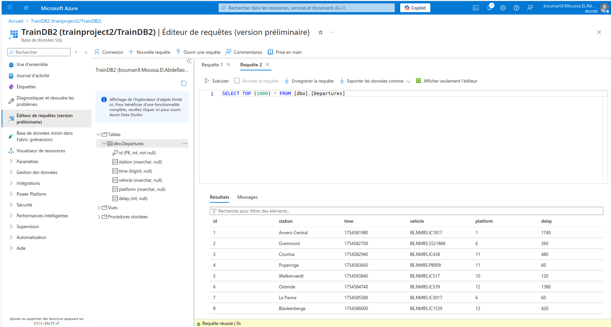

# 🚆 Azure Train Data Project with iRail API

## 📋 Project Overview

This project implements a real-time data pipeline fetching train departure data from the Belgian public transport **iRail API**, normalizing it, and storing it in an **Azure SQL Database**. The whole solution is deployed as an **Azure Function App** written in Python, enabling a cloud-native, serverless architecture.

---

## 🏗️ Architecture & Process

1. **📡 Data Fetching**  
   The Azure Function triggers on HTTP requests, querying the iRail API for live departure data of a specified station. The API response is a nested JSON containing train departure details such as station name, departure time (Unix timestamp), train vehicle, platform, and delay in seconds.

2. **🧹 Data Normalization**  
   Using Python’s `pandas.json_normalize`, the nested JSON data is flattened into a tabular format. This simplifies handling nested fields (like `stationinfo`), making it easier to insert into a relational database.

3. **🔐 Database Connection**  
   The function connects securely to an Azure SQL Database using `pyodbc`. Credentials and server information are stored as environment variables (App Settings) for security and flexibility.

4. **💾 Data Storage**  
   The function checks if the `Departures` table exists in the database and creates it if necessary. Then it inserts each normalized departure record into the SQL table, storing station, departure time, train vehicle, platform, and delay.

---

## ✨ Key Features

- **⚡ Serverless architecture:** Runs on Azure Functions with automatic scaling and no infrastructure management.  
- **⏱️ Real-time data:** Queries live train departures from iRail.  
- **📊 Data normalization:** Uses `pandas` to flatten complex JSON structures for easy SQL insertion.  
- **⚙️ Configurable:** Supports querying different stations via HTTP parameters.  
- **🔒 Secure:** Uses environment variables for all sensitive connection info.

---

## 🚀 Setup Instructions

1. Create an Azure SQL Database and note the server name, database name, username, and password.  
2. Create an Azure Function App with Python 3.10 runtime.  
3. Set environment variables (`DB_SERVER`, `DB_NAME`, `DB_USER`, `DB_PASSWORD`, `AzureWebJobsStorage`) in Function App settings.  
4. Deploy the Python function code to Azure Functions.  
5. Test the function using HTTP requests with a query parameter for station name.

---
## 🛠️ Usage

To trigger the function and insert live data for a station:

```bash
curl "https://<your-function-app>.azurewebsites.net/api/liveboard?station=Gent-Sint-Pieters"
```
The function returns the number of departures inserted into the database.



## 🔮 Future Improvements

- Implement additional routes for delays monitoring, route exploration, and other use cases.
- Add scheduled triggers to regularly update data without manual HTTP calls.
- Build a dashboard for data visualization and insights.
- Improve error handling and logging.

## 📦 Dependencies

- Python 3.10+
- pandas
- pyodbc
- azure-functions
